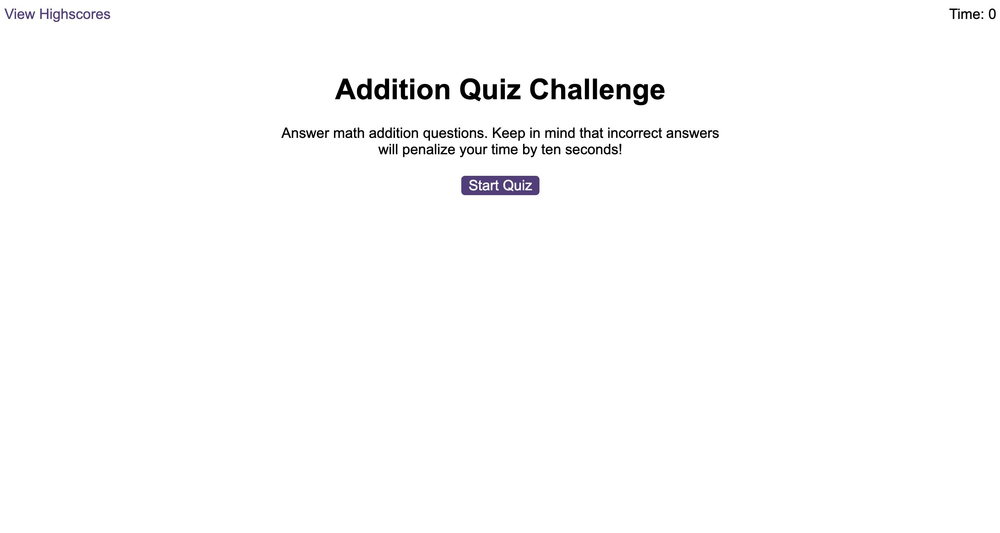
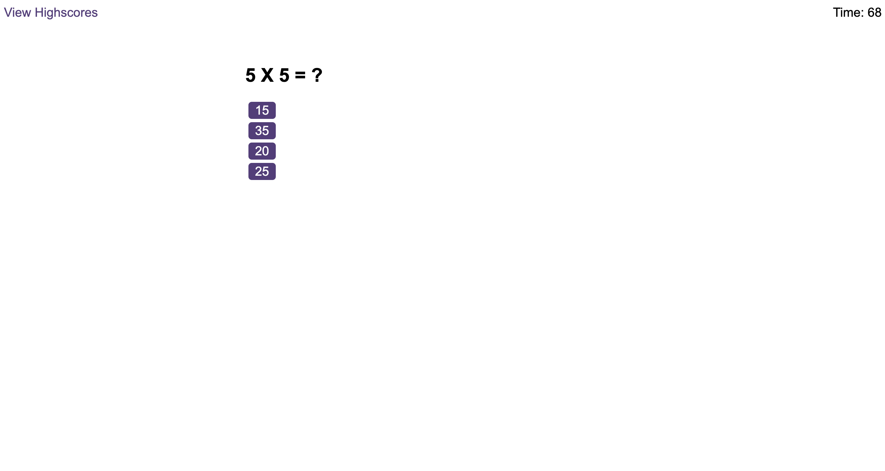
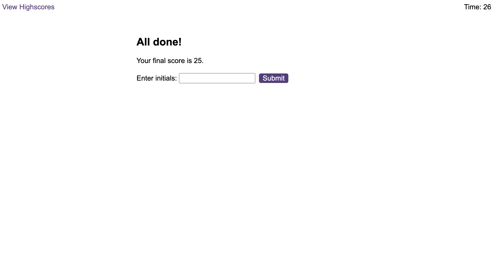
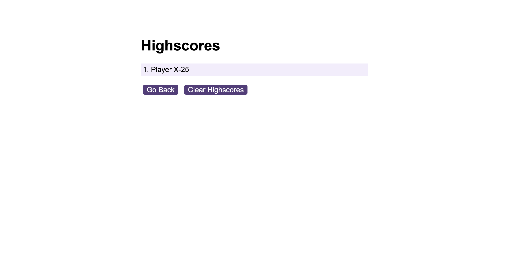

# Code-Quiz
A timed Math quiz on addition that stores high scores

## Pseudocode

- WHEN START BUTTON CLICKED
    - TIMER STARTS
    - FIRST QUESTION APPEARS
        - QUESTION CONTAINS BUTTONS FOR EACH ANSWER
        - WHEN ANSWER IS CLICKED
            - THE NEXT QUESTION APPEARS
            - RESULT OF THE QUESTION (EITHER RIGHT OR WRONG) APPEARS BELOW THE NEXT QUESTION
                - IF THE ANSWER IS WRONG
                    - A CERTAIN AMOUNT IS SUBTRACTED FROM THE TIME
    - GAME ENDS WHEN EITHER
        - ALL QUESTIONS ANSWERED
        - THE TIMER REACHES 0
    - WHEN THE GAME ENDS
        - RESULT SCREEN APPEARS WITH
            - FINAL SCORES
            - A SUBMIT SECTION TO SAVE THE RESULT TO LOCAL STORAGE
    - WHEN THE SCORE IS SUBMITTED
        - HIGHSCORES PAGE APPERS WITH
            - THE LIST OF SAVED SCORES
            - BUTTONS
                - GO BACK
                - CLEAR HIGHSCORES

## Screenshots

- Landing screen:

    

- Question screen:

    

- End screen:

    

- Scores screen:
    
    

## Links

- Live Site URL: [Math Quiz](https://luxury-paprenjak-306d84.netlify.app/)

## License

Licensed under the MIT license.

